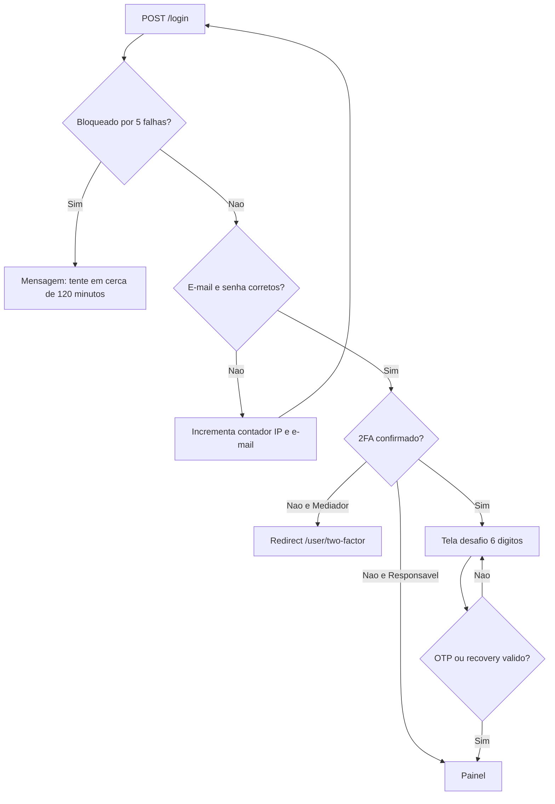

# Requisito 1 — Autenticação e gestão de credenciais

Documento de conformidade técnica do monólito **T.IA** (Laravel 13, PHP 8.3, MySQL). Destina-se à conversão em PDF para a banca.

- Aplicação local: `http://localhost:8080`
- Data de referência da implementação: 29/08/2026
- Prints de tela: anexar na seção 1.8 (não versionados neste repositório)

---

## Matriz de conformidade

| Item | Exigência | Situação | Onde está |
|---|---|---|---|
| 1.1 | Hash criptográfico moderno | Atendido | `HASH_DRIVER=argon2id` |
| 1.2 | Custo do hash justificado | Atendido | `ARGON_MEMORY` / `ARGON_TIME` / `ARGON_THREADS` |
| 1.3 | Salt único por usuário | Atendido | Salt embutido no digest Argon2id |
| 1.4 | Persistência segura de hash + salt | Atendido | Coluna `users.password` (formato PHC) |
| 1.5 | 2FA implementado | Atendido (Mediador) | `laragear/two-factor`, QR + TOTP |
| 1.6 | OTP após autenticação primária | Atendido | `Auth2FA::attempt()` no login |
| 1.7 | Fluxo documentado | Este documento | Seção 1.7 |
| 1.8 | Evidências funcionais | Atendido (testes + logs); prints pela equipe | Seção 1.8 |
| 1.9 | Expiração de sessão por inatividade | Atendido | `SESSION_LIFETIME=120` |
| 1.10 | Invalidação no logout | Atendido | `logout` + `DELETE FROM sessions` |
| 1.11 | Proteção contra força bruta | Atendido | 5 falhas → 2 horas |
| 1.12 | Justificativas técnicas | Este documento | Seção 1.12 |

---

## 1.1 Uso de hash criptográfico seguro

A aplicação armazena senhas com **Argon2id** (`HASH_DRIVER=argon2id` em `src/.env` e default em `src/config/hashing.php`).

Argon2id é a variante híbrida do Argon2 (RFC 9106), recomendada pelo OWASP Password Storage Cheat Sheet para senhas em servidor: resiste a ataques de GPU/ASIC (pelo custo de memória) e a ataques laterais (pelo componente data-independent).

O Laravel aplica o hash de duas formas equivalentes:

1. Cast Eloquent `password => hashed` no model `User` (cadastro, troca de senha autenticada, reset).
2. Facade `Hash::make()` / `Hash::check()` onde o framework mesmo chama o hasher.

A senha em claro **nunca** é persistida, logada ou enviada ao canal de auditoria.

Bcrypt permanece disponível como fallback do Laravel e é o driver dos **testes automatizados** (`HASH_DRIVER=bcrypt` e `BCRYPT_ROUNDS=4` em `src/phpunit.xml`), para a suíte não ficar lenta. Em ambiente real (Docker / `.env`) o driver é Argon2id.

---

## 1.2 Parâmetros de custo (justificativa)

Definidos em `src/config/hashing.php` e expostos no `.env` para o avaliador ver o custo sem abrir só o PHP:

| Parâmetro | Valor | Significado |
|---|---|---|
| `ARGON_MEMORY` | `65536` (64 MiB) | Memória por hash. Encarece ataques paralelos em GPU/ASIC. É o default documentado do Laravel 11+ e atende o piso típico da RFC 9106 em ambiente de desenvolvimento/TCC, sem tornar o login lento no PHP-FPM do container. |
| `ARGON_TIME` | `4` | Iterações (passes). Cada incremento aumenta o tempo de CPU de forma aproximadamente linear. Quatro passes equilibram usabilidade (login abaixo de ~500 ms em máquina de desenvolvimento) e custo para o atacante. |
| `ARGON_THREADS` | `1` | Um fio por hash. Evita saturar o pool do PHP-FPM sob vários logins simultâneos no mesmo container. |
| `rehash_on_login` | `true` | Se no futuro o custo subir, o hash é atualizado no próximo login válido, sem forçar reset em massa. |

Esses números **não** são “segurança máxima de produção bancária”; são um ponto explícito, reproduzível e justificável para a disciplina. Em produção de alta ameaça, a recomendação é medir o tempo de `Hash::make()` (alvo 250–500 ms) e aumentar `ARGON_MEMORY` / `ARGON_TIME` se o hardware aguentar.

---

## 1.3 Salt criptográfico único por usuário

Não existe coluna `salt`. O Argon2id (e o bcrypt) **embutem** um salt criptograficamente aleatório em cada digest, gerado pela biblioteca C (libsodium / `password_hash()`) a cada `Hash::make()`.

Consequência: dois usuários com a mesma senha geram strings diferentes. Rainbow tables globais deixam de valer — o atacante precisaria recomputar tabelas **por salt**.

Evidência automatizada: o teste `identical passwords produce distinct salted hashes` compara dois `Hash::make('Password1')` e exige que sejam distintos, ambos verificáveis com `Hash::check()`.

---

## 1.4 Armazenamento de hash + salt

A coluna `users.password` (`string`, 255 caracteres) guarda o digest no formato PHC, por exemplo:

```text
$argon2id$v=19$m=65536,t=4,p=1$<salt-em-base64>$<hash-em-base64>
```

Nela cabem algoritmo, versão, custos, salt e hash. Não há segundo campo para o salt.

O canal `audit` usa `email_hash` SHA-256 do e-mail quando aplicável; senha e OTP **jamais** entram no log nem na tabela `auth_audit_logs`.

---

## 1.5 Autenticação de dois fatores (2FA)

Implementação: pacote `laragear/two-factor` (TOTP RFC 6238).

| Parâmetro | Valor |
|---|---|
| Dígitos | 6 |
| Período | 30 s |
| Janela | 1 período (relógio levemente atrasado/adiantado) |
| Algoritmo | SHA-1 (compatível com Google Authenticator / Authy) |
| Issuer | `T.IA` (`OTP_TOTP_ISSUER`) |
| Secret | tabela `two_factor_authentications` (não colunas Fortify em `users`) |
| Recovery | 10 códigos de uso único, 8 caracteres |

**Por que só o Mediador:** o requisito da disciplina pontua o 2FA no perfil que opera acompanhamento profissional. O Responsável usa autenticação primária; o middleware `EnsureMediatorTwoFactor` não o força a escanear QR.

**Por que não Fortify:** o Breeze já registra `/login`. Fortify no mesmo app duplica rotas e quebra o desafio 2FA. O Laragear encaixa em `LoginRequest` via `Auth2FA::attempt()`.

Fluxo de ativação:

1. Cadastro ou login como Mediador sem 2FA confirmado.
2. Middleware redireciona para `GET /user/two-factor`.
3. A tela mostra QR SVG + secret copiável.
4. `POST /user/two-factor` com OTP de 6 dígitos chama `confirmTwoFactorAuth()`. Só então o segundo fator é ligado.
5. Dez códigos de recuperação são exibidos **uma vez**.
6. Mediador **não pode** desativar o 2FA (`403` em `DELETE /user/two-factor`).

Um OTP já usado é recusado na mesma janela de 30 s (replay protection via cache).

---

## 1.6 Validação do 2FA após a autenticação primária

O desafio de 6 dígitos **só** aparece depois que e-mail e senha são aceitos.

1. `POST /login` com e-mail e senha.
2. `Auth2FA::attempt()` valida as credenciais primárias no guard.
3. Se o 2FA estiver confirmado, as credenciais ficam cifradas na sessão (`_2fa_login`) e a aplicação devolve a view `auth.two-factor-challenge` — **sem** abrir o painel.
4. O Mediador informa `2fa_code` (ou `recovery_code`) em novo `POST /login`.
5. OTP válido: sessão autenticada, redirecionamento ao painel.
6. OTP inválido: permanece no desafio; após 5 falhas aplica-se o mesmo bloqueio de 2 horas (`login-2fa:{ip}`).

Sem senha correta não há tela de OTP (evita enumerar contas só no segundo fator). `TwoFactor::hasCodeOrFails()` só roda se o guard já aceitou as credenciais primárias.

---

## 1.7 Fluxo de autenticação

O T.IA distingue dois papéis no cadastro (`users.role`):

- **Responsável** — e-mail + senha. 2FA não é obrigatório.
- **Mediador** (psicólogo, pedagogo, fonoaudiólogo, etc.) — e-mail + senha **e** TOTP de 6 dígitos antes do painel.

### Cadastro

1. `GET /register`.
2. Nome, e-mail, perfil (`responsavel` ou `mediador`) e senha (mínimo 8 caracteres, maiúscula, minúscula e número — `Password::defaults()`).
3. O Eloquent grava o hash Argon2id; a senha em claro não atravessa o model.
4. O Laravel autentica a sessão recém-criada e redireciona para `/dashboard`.
5. Se o papel for Mediador e o 2FA ainda não estiver confirmado, `EnsureMediatorTwoFactor` redireciona para `GET /user/two-factor`.

### Login (autenticação primária)

1. `GET /login`.
2. `POST /login` valida e-mail e senha em `LoginRequest`.
3. Antes de autenticar, o sistema consulta o bloqueio por força bruta (item 1.11).
4. `Auth2FA::attempt()` confere as credenciais.
5. Responsável (ou Mediador sem 2FA ainda ativo): a sessão é regenerada e o usuário segue ao painel (Mediador sem 2FA cai no setup).
6. Mediador com 2FA confirmado: a senha correta **não** abre o painel (item 1.6).

### Logout

`POST /logout` encerra o guard, apaga **todas** as linhas de `sessions` daquele `user_id`, invalida o cookie de sessão e regenera o token CSRF.



### Arquivos-chave

| Etapa | Arquivo |
|---|---|
| Login / throttle / 2FA | `src/app/Http/Requests/Auth/LoginRequest.php` |
| Sessão / logout | `src/app/Http/Controllers/Auth/AuthenticatedSessionController.php` |
| Cadastro + papel | `src/app/Http/Controllers/Auth/RegisteredUserController.php` |
| QR / confirmar OTP | `src/app/Http/Controllers/Profile/TwoFactorController.php` |
| 2FA obrigatório (Mediador) | `src/app/Http/Middleware/EnsureMediatorTwoFactor.php` |
| Hash | `src/config/hashing.php` e `HASH_DRIVER` no `.env` |
| Sessão | `src/config/session.php` |
| TOTP | `src/config/two-factor.php` |

---

## 1.8 Evidências funcionais

### Testes automatizados

Na raiz do repositório, com os containers no ar:

```bash
docker compose exec php php artisan test --compact tests/Feature/Auth
```

Cobertura relacionada a este requisito (`src/tests/Feature/Auth/`):

| Teste | Item |
|---|---|
| Tela de login renderiza | 1.7 |
| Login com senha correta autentica o Responsável | 1.7 |
| Senha inválida não autentica | 1.7 / 1.11 |
| 5 falhas → 6ª tentativa bloqueada (~120 minutos) | 1.11 |
| Mediador sem 2FA é redirecionado ao QR | 1.5 |
| Mediador com 2FA: senha correta **não** entra; OTP válido completa o login | 1.5 / 1.6 |
| Dois hashes da mesma senha são distintos | 1.3 |
| Digest contém algoritmo (salt/custo) | 1.1 / 1.4 |
| Logout encerra a sessão | 1.10 |

### Logs de auditoria

Canal `audit` em `src/config/logging.php` → `src/storage/logs/audit-YYYY-MM-DD.log`. Os mesmos eventos vão para a tabela `auth_audit_logs`.

Campos: `timestamp` (ISO-8601), `event`, `outcome`, `email_hash` (SHA-256), `ip`, `user_agent`, `meta`. Senha, OTP e token de reset **não** são gravados.

Trecho real (ambiente de teste, e-mail só como hash):

```json
{
  "timestamp": "2026-08-29T22:34:22+00:00",
  "event": "login_lockout",
  "outcome": "blocked",
  "email_hash": "185a6161c77dafc2e445a0ec3d353dbe39aa3d188bfd01b6ed9de71d1157167d",
  "ip": "127.0.0.1",
  "user_agent": "Symfony",
  "meta": { "minutes": 120 }
}
```

Evento de 2FA ativado (uso local):

```json
{
  "timestamp": "2026-08-29T22:49:15+00:00",
  "event": "two_factor_enabled",
  "outcome": "success",
  "email_hash": "752d40616ca2627c2682a8881a182e306fc70c71ad0ac525503c7fe1aefd43ea",
  "ip": "172.21.0.1",
  "user_agent": "Mozilla/5.0 … Mobile … Safari",
  "meta": []
}
```

### Prints (anexar na conversão para PDF)

A equipe cola as capturas abaixo. Não versionar PNG neste repositório.

1. **Tela de login** (`/login`) — _colar print_
2. **Cadastro com perfil Mediador** (`/register`) — _colar print_
3. **QR + campo de 6 dígitos** (`/user/two-factor`) — _colar print_
4. **Desafio OTP após senha correta** — _colar print_
5. **Painel autenticado** (`/dashboard`) — _colar print_
6. **Mensagem de bloqueio na 6ª tentativa** — _colar print_
7. **(Opcional)** trecho de `storage/logs/audit-*.log` ou da tabela `auth_audit_logs` — _colar print_

---

## 1.9 Sessões com expiração por inatividade

| Configuração | Valor | Motivo |
|---|---|---|
| `SESSION_DRIVER` | `database` | Sessões auditáveis e invalidáveis no MySQL (`sessions`). |
| `SESSION_LIFETIME` | `120` minutos | Expiração por **inatividade** (idle). Duas horas cobrem uma sessão de atendimento sem manter login eterno. |
| `SESSION_ENCRYPT` | `true` | Payload cifrado em repouso na tabela. |

O Laravel renova `last_activity` a cada request autenticado. Sem atividade por 120 minutos, a sessão deixa de ser válida.

---

## 1.10 Invalidação de sessão no logout

`AuthenticatedSessionController::destroy`:

1. `Auth::guard('web')->logout()`
2. `DELETE FROM sessions WHERE user_id = ?` — encerra também outras sessões persistidas (outros navegadores)
3. `$request->session()->invalidate()`
4. `$request->session()->regenerateToken()` (CSRF)

A troca de senha no reset (Parte 2) também apaga as sessões daquele `user_id`, para um token roubado não manter o invasor logado.

---

## 1.11 Proteção contra força bruta

Regra acadêmica: **5** tentativas inválidas → bloqueio de **2 horas** (`LOGIN_MAX_ATTEMPTS=5`, `LOGIN_DECAY_SECONDS=7200`).

Chaves independentes no `RateLimiter`:

- `login-email:{email}`
- `login-ip:{ip}`
- `login-2fa:{ip}` (OTP inválido)

Qualquer uma no limite bloqueia. Assim, um atacante não contorna o teto trocando só o e-mail (mesmo IP) nem só o IP (mesmo e-mail, se viável).

Há ainda `throttle:login` (20 POSTs/minuto por IP) contra inundação de requisições, distinto da contagem de **senhas erradas**.

A mensagem ao usuário usa minutos restantes (`ceil($seconds / 60)` → cerca de **120 minutos** na 6ª tentativa).

O evento `Lockout` alimenta o canal `audit` (`login_lockout`, `meta.minutes = 120`).

---

## 1.12 Justificativas técnicas (síntese)

| Escolha | Por quê |
|---|---|
| Laravel 13 + Breeze Blade | Scaffold de auth auditável (controllers e views no app), sem SPA. Adequado ao monólito da disciplina. Laravel 11 já estava fora de suporte de segurança em 2026. |
| Argon2id | Padrão OWASP atual para senha em servidor; salt e custos no próprio digest. |
| Custos 64 MiB / 4 / 1 | Compromisso explícito entre resistência a GPU e latência no PHP-FPM do Docker acadêmico. |
| 2FA TOTP local (Laragear) | Sem SMS (caro, interceptável) e sem Fortify (conflito com Breeze). QR + OTP de 6 dígitos atende 1.5 e 1.6. |
| 2FA só no Mediador | Escopo pontuado pela banca; menor fricção para o Responsável. |
| Sessão em MySQL + encrypt | Invalidação total no logout e no reset; não depende só de cookie opaco. |
| 120 min idle | Sessão de atendimento; não é “remember forever”. |
| Lockout 5 × 2 h | Exigência literal do enunciado; o delay curto (60 s) do Breeze padrão **não** bastaria. |
| Rate limit duplo (e-mail **ou** IP) | Impede contornar o teto mudando um único eixo. |
| Auditoria com `email_hash` | Permite correlacionar incidentes sem expor PII em claro no arquivo de log. |

---

## Como reproduzir (desenvolvimento)

```bash
cd ~/T.IA
docker compose up -d
# App: http://localhost:8080
docker compose exec php php artisan test --compact tests/Feature/Auth
```

Variáveis relevantes no `src/.env`: `HASH_DRIVER`, `ARGON_MEMORY`, `ARGON_TIME`, `ARGON_THREADS`, `SESSION_LIFETIME`, `SESSION_ENCRYPT`, `LOGIN_MAX_ATTEMPTS`, `LOGIN_DECAY_SECONDS`, `OTP_TOTP_ISSUER`.

A recuperação de senha (Parte 2) está em [REQUISITO-2-recuperacao-senha.md](REQUISITO-2-recuperacao-senha.md).
