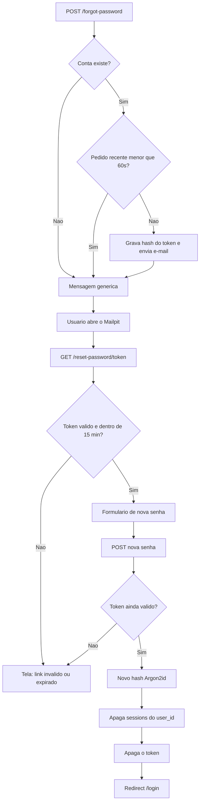

# Requisito 2 — Recuperação de senha

Documento de conformidade técnica do monólito **T.IA** (Laravel 13, PHP 8.3, MySQL, Mailpit). Destina-se à conversão em PDF para a banca.

- Aplicação local: `http://localhost:8080`
- Caixa de e-mail local (Mailpit): `http://localhost:8025`
- Prints de tela: anexar na seção 2.9 (não versionados neste repositório)

Este bloco cobre o fluxo “esqueci a senha”: pedido do link, token de uso único com prazo curto, redefinição com política de senha, invalidação de sessões e auditoria.

---

## Matriz de conformidade

| Item | Exigência | Situação | Onde está |
|---|---|---|---|
| 2.1 | Fluxo documentado | Este documento | Seção 2.1 |
| 2.2 | Token de uso único | Atendido | Broker apaga a linha em `password_reset_tokens` após o reset |
| 2.3 | Expiração do token | Atendido | `PASSWORD_RESET_EXPIRE=15` (minutos) |
| 2.4 | Token persistido com hash | Atendido | `Hash::make($token)` na tabela; o e-mail leva só o valor em claro |
| 2.5 | Falha clara para token expirado ou reusado | Atendido | `GET` e `POST` mostram tela sem formulário |
| 2.6 | Auditoria dos eventos | Atendido | Canal `audit` + tabela `auth_audit_logs` |
| 2.7 | Invalidação de sessões após a troca | Atendido | `DELETE FROM sessions WHERE user_id = ?` |
| 2.8 | Política de senha na redefinição | Atendido | `Password::min(8)->mixedCase()->numbers()` |
| 2.9 | Evidências | Atendido (testes + logs); prints pela equipe | Seção 2.9 |

---

## 2.1 Fluxo de recuperação

1. O usuário acessa `GET /forgot-password`.
2. Informa o e-mail em `POST /forgot-password`.
3. Se a conta existir **e** o throttle de 60 s não estiver ativo, o Laravel gera um token, grava o **hash** em `password_reset_tokens` e envia o link `http://localhost:8080/reset-password/{token}`.
4. A tela **sempre** responde com a mensagem genérica: *“Se o e-mail existir em nossa base, enviaremos um link para redefinição de senha.”*
5. O avaliador abre o Mailpit (`http://localhost:8025`) e clica no link.
6. `GET /reset-password/{token}?email=...` **valida o token na hora**. Link válido → formulário. Link expirado, já usado ou incompleto → tela *“Link inválido ou expirado”*, **sem** campos de senha.
7. `POST /reset-password` valida de novo o token e a política de senha. Se o token já não valer, a mesma tela de bloqueio é exibida (não fica um formulário inútil).
8. Sucesso: a senha é rehashed com Argon2id, o `remember_token` é rotacionado, as sessões daquele usuário são apagadas, o token é **removido** da tabela, evento `PasswordReset` alimenta a auditoria, redirecionamento para `/login`.
9. Falha: registro `password_reset` / `outcome=failure` (`meta.reason=invalid_or_expired_token`) e botão para solicitar um novo link.

Tokens expirados também são varridos pelo comando agendado `auth:clear-resets` a cada 15 minutos (`src/routes/console.php`).



### Arquivos-chave

| Etapa | Arquivo |
|---|---|
| Pedido do link | `src/app/Http/Controllers/Auth/PasswordResetLinkController.php` |
| Nova senha / bloqueio 2.5 | `src/app/Http/Controllers/Auth/NewPasswordController.php` |
| Tela de link inválido | `src/resources/views/auth/reset-password-invalid.blade.php` |
| Expiração / throttle | `src/config/auth.php` (`passwords.users`) |
| Mensagens | `src/lang/pt_BR/passwords.php` |
| Limpeza de tokens | `src/routes/console.php` (`auth:clear-resets`) |
| Auditoria | `src/app/Actions/AuditAuthEvent.php` e listeners em `src/app/Listeners/` |

---

## 2.2 Token de uso único

O repositório de tokens do Laravel (`DatabaseTokenRepository`):

- Há **no máximo uma linha por e-mail**. Um novo pedido **apaga** o token anterior (`deleteExisting`).
- Após `Password::reset()` bem-sucedido, `delete($user)` remove a linha.
- Reenviar o mesmo link devolve `passwords.token` (inválido). O teste `reset token cannot be reused` cobre esse caso.

O valor enviado no e-mail é um HMAC-SHA256 de 40 bytes aleatórios com a `APP_KEY`. Quem interceptar só o banco **não** obtém o token em claro.

---

## 2.3 Expiração

| Variável | Valor | Efeito |
|---|---|---|
| `PASSWORD_RESET_EXPIRE` | `15` minutos | `created_at + 15 min` torna o token inválido (`tokenExpired`) |
| `PASSWORD_RESET_THROTTLE` | `60` segundos | Impede disparar dezenas de e-mails em sequência |

Quinze minutos está na faixa usual 15–60 min: curto o bastante para reduzir a janela de um e-mail encaminhado/comprometido, longo o bastante para o Mediador abrir o Mailpit no laboratório.

O teste `expired reset token is rejected` avança 16 minutos no relógio da aplicação e exige a tela de bloqueio. O teste `opening an expired reset link is blocked without showing the form` cobre o **acesso** ao link (`GET`), não só o envio da nova senha.

---

## 2.4 Persistência com hash

`getPayload()` grava:

```text
email | token = Hash::make($tokenEmClaro) | created_at
```

Na verificação, `Hash::check($token, $record['token'])`. Em ambiente real o hasher é Argon2id (mesmo do item 1.1). O token em claro vive só no e-mail e na memória do request.

A tabela `password_reset_tokens` **não** guarda a senha nova nem a antiga.

---

## 2.5 Falha correta para token expirado ou reusado

O enunciado pede bloqueio **ao acessar** o link, não só ao gravar a senha.

`NewPasswordController::create` chama `Password::tokenExists()` no `GET /reset-password/{token}?email=...` (o Mailpit já manda o e-mail na query). Se o token passou de 15 minutos, já foi usado ou está incompleto:

- o formulário de nova senha **não** é renderizado;
- a view `auth.reset-password-invalid` explica que o link vale 15 minutos e é de uso único;
- há um botão **Solicitar novo link** (`/forgot-password`);
- a auditoria registra `password_reset` / `failure` / `invalid_or_expired_token` (`meta.source=link_opened` no GET).

O `POST` com token morto cai na **mesma** tela (não deixa um campo de senha que nunca vai funcionar). A mensagem não distingue “expirou” de “já usado”, para não dar pista extra a um atacante.

Anti-enumeração no pedido do e-mail permanece: `PasswordResetLinkController` sempre devolve `passwords.sent`, exista ou não a conta.

---

## 2.6 Auditoria

Todos os eventos passam por `AuditAuthEvent::record()`:

| Evento | Outcome | Quando |
|---|---|---|
| `password_reset_link_sent` | `success` | Link enviado (listener nativo `PasswordResetLinkSent`) |
| `password_reset_link_sent` | `failure` | E-mail desconhecido ou throttle (controller) |
| `password_reset` | `success` | Senha redefinida (listener nativo `PasswordReset`) |
| `password_reset` | `failure` | Token inválido/expirado (`invalid_or_expired_token`) ou usuário inválido (`unknown_user`) |

Payload JSON (arquivo `storage/logs/audit-YYYY-MM-DD.log` e tabela `auth_audit_logs`):

```json
{
  "timestamp": "2026-08-29T22:45:59+00:00",
  "event": "password_reset",
  "outcome": "success",
  "email_hash": "f0adc116e8b463287347d64dd4d685a405b0658a28e111c8759b2951a939c2ab",
  "ip": "172.21.0.1",
  "user_agent": "Mozilla/5.0 … Chrome …",
  "meta": []
}
```

E-mail só como SHA-256. Token e senha nunca entram no log.

---

## 2.7 Invalidação de sessões após a troca

No callback de `Password::reset()` (`NewPasswordController`):

1. Nova senha (cast `hashed` → Argon2id).
2. Novo `remember_token` aleatório (invalida “lembrar-me”).
3. `DB::table('sessions')->where('user_id', $user->id)->delete()`.

Assim, quem já estava autenticado em outro navegador cai no login. O teste `successful password reset deletes persisted sessions for that user` insere uma linha em `sessions` e exige contagem zero depois do reset.

---

## 2.8 Política de senha na redefinição

A nova senha usa a mesma regra do cadastro (`AppServiceProvider`):

- mínimo 8 caracteres
- maiúscula e minúscula (`mixedCase`)
- pelo menos um número (`numbers`)

`uncompromised()` (Have I Been Pwned) **não** está ligado neste ambiente Docker acadêmico: o container pode não alcançar a API externa de forma estável. A política local já impede senhas triviais do tipo `12345678`.

---

## 2.9 Evidências funcionais

### Testes automatizados

```bash
docker compose exec php php artisan test --compact tests/Feature/Auth/PasswordResetTest.php
```

| Teste | Item |
|---|---|
| Tela “esqueci a senha” renderiza | 2.1 |
| Link é solicitado para e-mail cadastrado | 2.1 |
| E-mail desconhecido: mensagem genérica, sem notificação | anti-enumeração |
| Tela de nova senha abre com token **válido** | 2.1 / 2.5 |
| `GET` de link expirado: tela de bloqueio, sem formulário | 2.5 |
| `GET` de link já usado: tela de bloqueio | 2.4 / 2.5 |
| Reset com token válido redireciona ao login | 2.1 / 2.8 |
| `POST` do mesmo token depois do uso é bloqueado | 2.4 / 2.5 |
| `POST` com 16 minutos é bloqueado | 2.3 / 2.5 |
| Sessões do `user_id` são apagadas | 2.7 |
| Auditoria de sucesso grava **uma** linha | 2.6 |

### Como a banca reproduz no browser

1. Subir `docker compose up -d` (precisa de `nginx`, `php`, `mysql` e **mailpit**).
2. Ter uma conta já cadastrada (ou criar em `/register`).
3. Abrir `http://localhost:8080/forgot-password` e informar o e-mail.
4. Abrir `http://localhost:8025`, localizar a mensagem de `nao-responda@tia.test`.
5. O link deve apontar para `http://localhost:8080/reset-password/...` (`APP_URL`).
6. Definir senha no formato `SenhaNova1`.
7. Tentar o **mesmo** link de novo — deve aparecer *“Link inválido ou expirado”*, sem o formulário.
8. Confirmar login com a senha nova.

### Prints (anexar na conversão para PDF)

1. **Tela “esqueci a senha”** — _colar print_
2. **Mensagem genérica após enviar o e-mail** — _colar print_
3. **Mailpit com o e-mail de reset** — _colar print_
4. **Formulário de nova senha** — _colar print_
5. **Login após a redefinição** — _colar print_
6. **Tela “Link inválido ou expirado”** (reuso ou prazo vencido) — _colar print_
7. **(Opcional)** linha `password_reset` no `audit-*.log` — _colar print_

---

## Justificativas (síntese)

| Escolha | Por quê |
|---|---|
| 15 minutos de validade | Janela curta o bastante para o laboratório e para o enunciado (15–60 min). |
| Hash do token no banco | Um dump de `password_reset_tokens` não autentica o atacante. |
| Uso único + uma linha por e-mail | Impede replay do link e acúmulo de tokens válidos. |
| Mensagem genérica | Evita enumeração de contas (OWASP Authentication). |
| Mailpit | E-mail testável sem SMTP real nem dados de aluno em provedor externo. |
| Apagar `sessions` no reset | Credencial nova implica sessão nova; o invasor com cookie antigo sai. |
| `email_hash` na auditoria | Rastreio de incidentes sem gravar PII em claro. |

---

## Como reproduzir (desenvolvimento)

```bash
cd ~/T.IA
docker compose up -d
# App:      http://localhost:8080/forgot-password
# Mailpit:  http://localhost:8025
docker compose exec php php artisan test --compact tests/Feature/Auth/PasswordResetTest.php
```

Variáveis relevantes no `src/.env`: `MAIL_HOST=mailpit`, `MAIL_PORT=1025`, `APP_URL=http://localhost:8080`, `PASSWORD_RESET_EXPIRE`, `PASSWORD_RESET_THROTTLE`.
